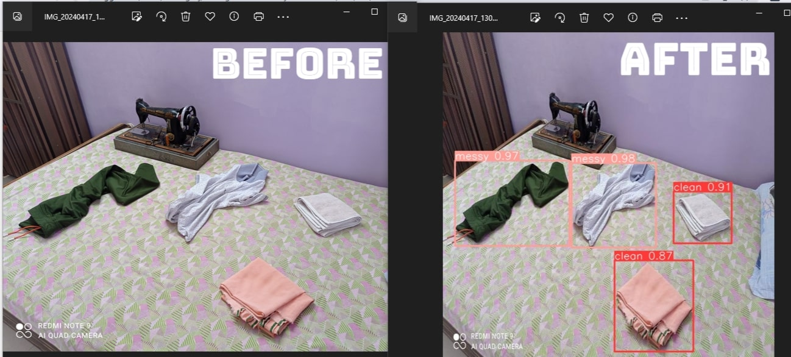
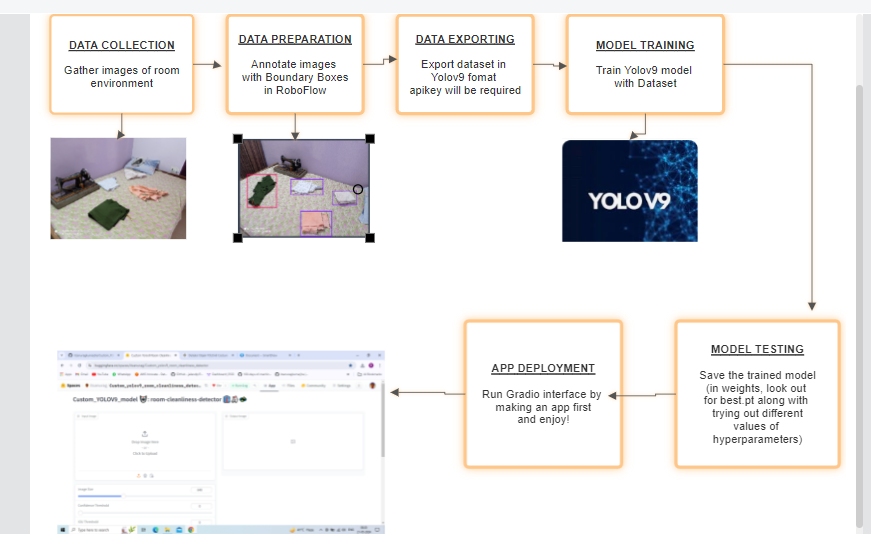

# Custom_YOLOV9_Room_cleanliness_Detector 🤖🧹
- (**just wanted to mention that idea for this project came from my mom always scolding me about how my room is always messed up**😅)
- This project leverages a custom-trained YOLOv9 model to detect objects related to room cleanliness. Built with Gradio, it provides an interactive web interface where users can upload images and adjust detection parameters. The app returns images with annotated bounding boxes around detected objects, aiding in room organization tasks.

## Overview
The Room Cleanliness Detector project utilizes a custom-trained YOLOv9 model to identify objects that may contribute to clutter in a room. The project features an interactive web interface built with Gradio, allowing users to upload images and visualize detection results in real-time. By highlighting objects such as clothes and trash, this tool aids in maintaining an organized and tidy living space. The model is trained on a dataset sourced and annotated using Roboflow, ensuring accurate and efficient detection.

## ✨ Features

- 🏠 Detects objects related to room cleanliness such as clothes and trash.
- 📸 Allows users to upload images of their room for analysis.
- 🎨 Annotates images with bounding boxes around detected objects.
- ⚙️ Provides adjustable parameters for image size, confidence threshold, and IoU threshold.
- 🤖 Utilizes a custom-trained YOLOv9 model for accurate object detection.
- 🌐 Features an easy-to-use web interface powered by Gradio.
- 📊 Displays real-time detection results with detailed object information.
- 💾 Supports training with custom datasets sourced and annotated from Roboflow.

## 📽️ Demo Video


## Comparison Results:
<p align="center">

</p>

## 🧠 How the project works:

<p align="center">

</p>

## 🖼 Dataset

The dataset for training the YOLOv9 model was sourced from Roboflow. Here's how you can access and prepare the dataset:

1. **Create an Account on Roboflow**: Sign up at [Roboflow](https://roboflow.com/).
2. **Collect Images**: Gather images of rooms with various objects that you want to detect (e.g., clothes, trash).
3. **Annotate Images**: Use Roboflow's annotation tool to label objects in your images.
4. **Export Dataset**: Export the annotated dataset in YOLO format(via apikey if possible)

## 🔍 Annotation tool:
<p align="center">

</p>

## ⚙ How the annotation/exporting is done:


## 💡 Model Training
- 📒 Collab notebook has been uploaded also for educational purposes
Once you have your dataset, you can train the YOLOv9 model. Here is an example of how to train the model using the YOLO library:
```python
from ultralytics import YOLO

# Load a pre-trained model or start training from scratch
model = YOLO("yolov9s.pt")  # Pre-trained model checkpoint

# Train the model with your dataset
model.train(data="path/to/your/dataset.yaml", epochs=[no. depending on hyperparameters])

# Save the best model
model.save("best_model.pt")

```

## 🚀 Installation:
### Prerequisites

- Python 3.8 or higher
- pip (Python package installer)
- GPU else Google Collab/Kaggle Notebooks

### Clone the Repository

```bash
git clone https://github.com/yourusername/room-cleanliness-detector.git
cd room-cleanliness-detector

```

### Install Dependencies
```bash
pip install -r requirements.txt
```

### Download the Trained Model: Ensure you have best_model.pt in the project directory.

## 🛠️ Usage
### Running the Web Application:
```bash
python app.py
```
This will start the Gradio web application. You can access it in your browser at the URL provided in the terminal.
### Using the Web Interface
- Upload an image of your room or select any image from examples given.
- Adjust the image size, confidence threshold, and IoU threshold using the provided sliders.
- Click the submit button to see the detection results with annotated bounding boxes around detected objects.

## 📂 Project Structure
- app.py: Main application file containing the Gradio interface and the main functions.
- requirements.txt: List of dependencies required for the project.
- best_model.pt: Pre-trained YOLOv9 model file.
- render.py: Custom rendering functions for displaying detection results.
- data/: Directory containing the dataset (not included in the repository for size reasons).

## 🧠 How It Works
- **Image Upload**: Users upload an image of their room via the Gradio interface.
- **Parameter Adjustment**: Users can adjust image size, confidence threshold, and IoU threshold using sliders.
- **Object Detection**: The uploaded image is processed by the custom-trained YOLOv9 model to detect objects related to room cleanliness.
- **Result Annotation**: Detected objects are annotated with bounding boxes, showing their locations and types.
- **Result Display**: The annotated image is displayed in the Gradio interface, providing users with visual feedback on detected objects.
- **Custom Rendering**: Utilizes custom rendering functions to enhance the visibility and presentation of detection results.

## 🤝 Contributing
I welcome contributions to enhance the project. If you have ideas or improvements, please submit a pull request. Follow these steps to contribute:

- Fork the repository.
- Create a new branch: git checkout -b feature/YourFeature.
- Commit your changes: git commit -m 'Add some feature'.
- Push to the branch: git push origin feature/YourFeature.
- Open a pull request.

## 🙏 Acknowledgements
- Gradio
- RoboFlow
- Kaggle/GoogleCollab
- Hugging Face 🤗
- Ultralytics Team
